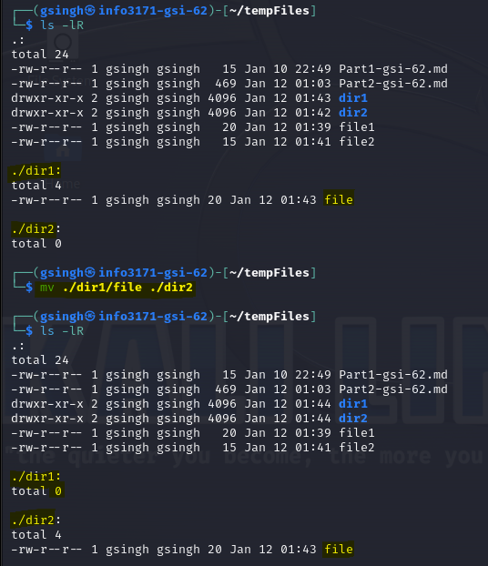

#Part 2 - Unix Cheat Sheet  
|Command|Description|Example|Screenshot|
|--|--|--| --|
|`uname`|Show the Unix system information in Detail|`uname -a`|
|`whoami`|Display what user you are logged in as|`whoami`|
|`sudo`|This command is used to execute other commands with admin privileges. For example, sudo apt update to update the package list|`sudo apt update`|
|`man`|This command is used to show manual for a given command|`man ls`|
|`diff`|This command is used to compare 2 Files and it outputs the difference|`diff file1 file2`|
|`pwd`|Dispay the current directory you are in|`pwd`|
|`mv`|Move Files or rename files by giving the path|`mv ./dir1/file ./dir2`|
|`rm`|Delete file/dir permanently, for dir's that have files inside them we need to run recursively(-r)|`rm -r dir1`|
|`du`|Show disk usage of current directory|`du -sh`|
|`grep`|Search a text pattern|`grep textpattern dummy.log`|
