#Part 3 - Some basic tasks in Unix
|Task|Commands|Screenshot|
|--|--| --|
|Navigate to home and create a folder called Lab1-gsi-62). Using the command line create the data structure as listed in the "Submission Requirements' section of this document|`cd ~` `tree Lab1-gsi-62`|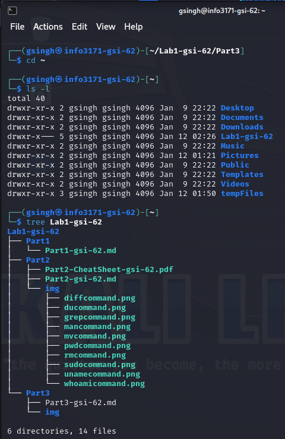|
|Install the cowsay command, run it. Be sure to record how you installed the package via command line and then via the GUI|`sudo apt install cowsay` `cowsay Hello Programmers` `sudo synaptic` `sudo Hello Programmers from GUI`|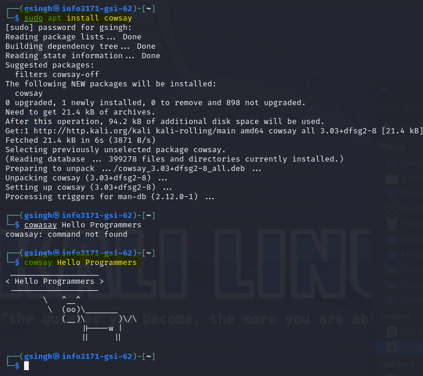   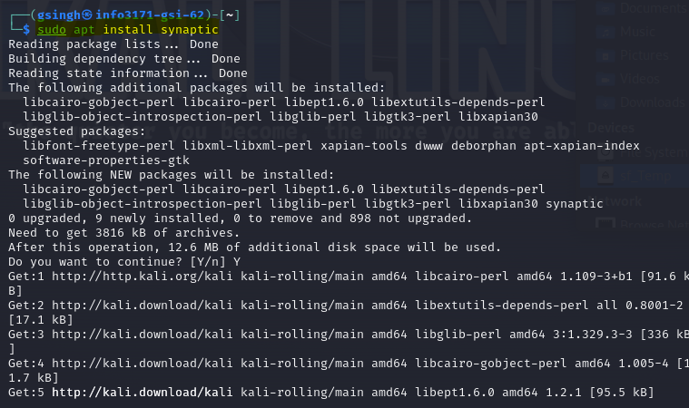   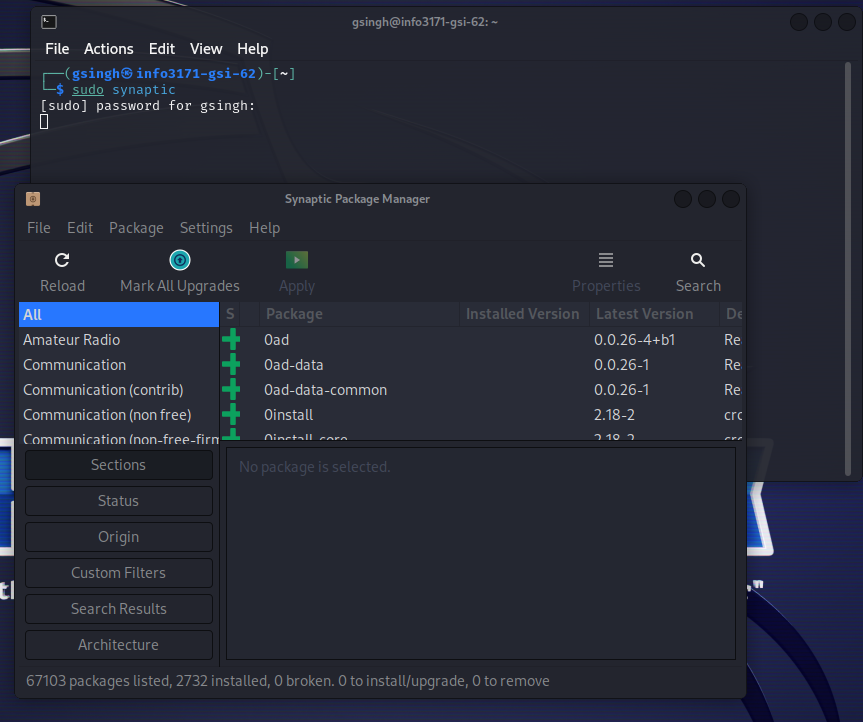   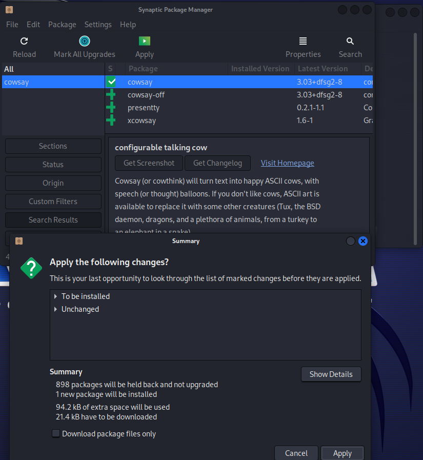   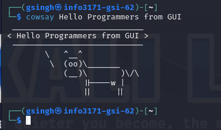|
|For vi(m) choose a theme and install it, and some configuration settings for vim at a miniumum you should turn on line numbers and syntax highlighting, also select theme of your choosing and install them|`colorscheme gruvbox` `set background=dark` `set number` `syntax enable` `set guifont=Courier\ New:h12`|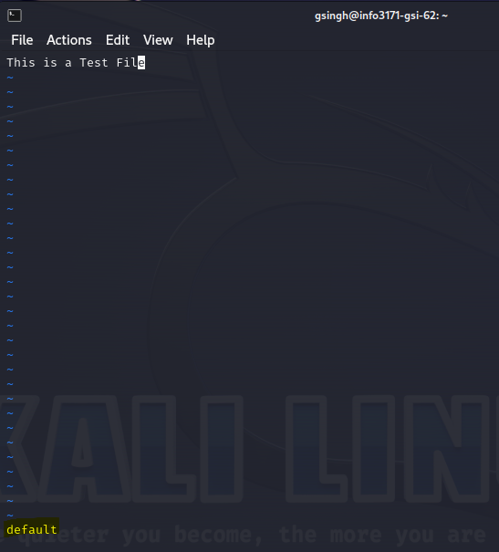 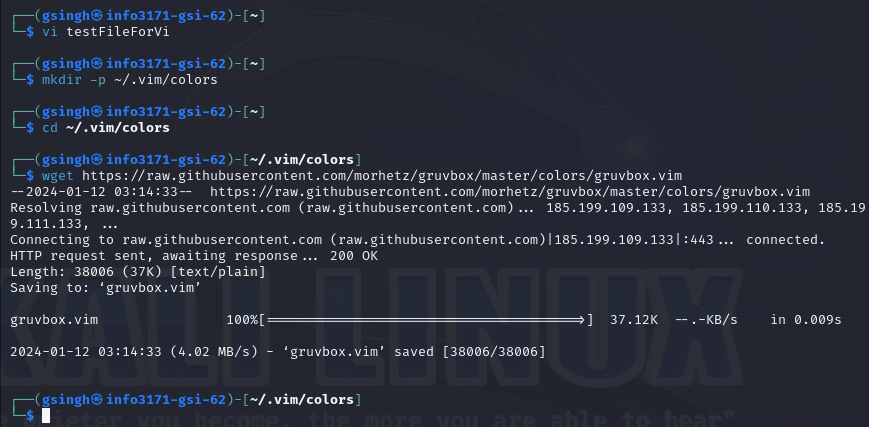 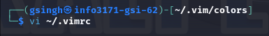 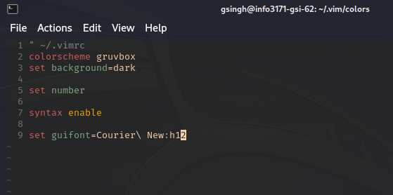 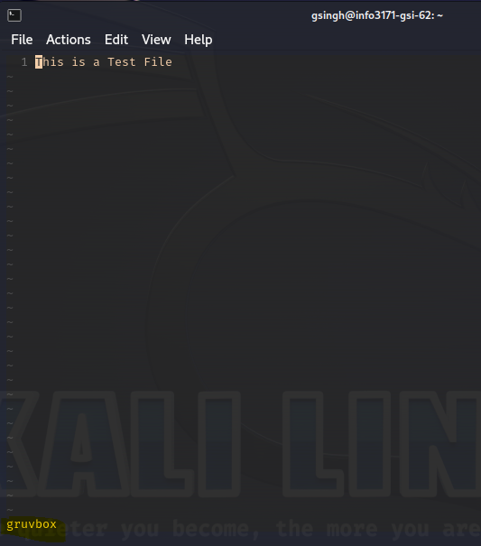|